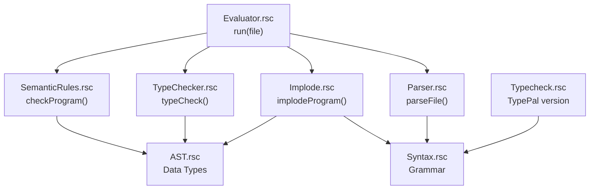
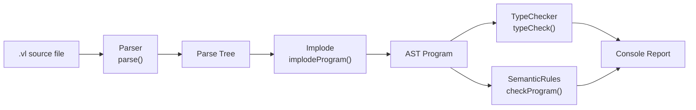
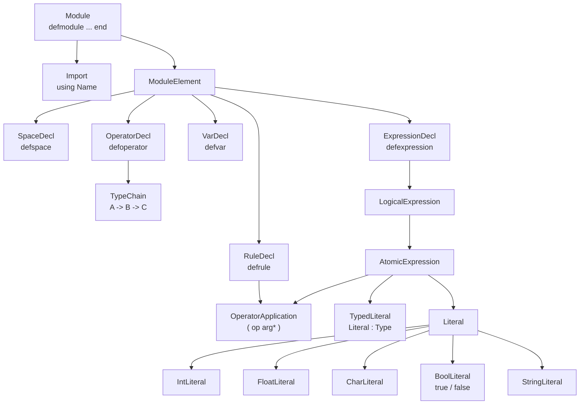
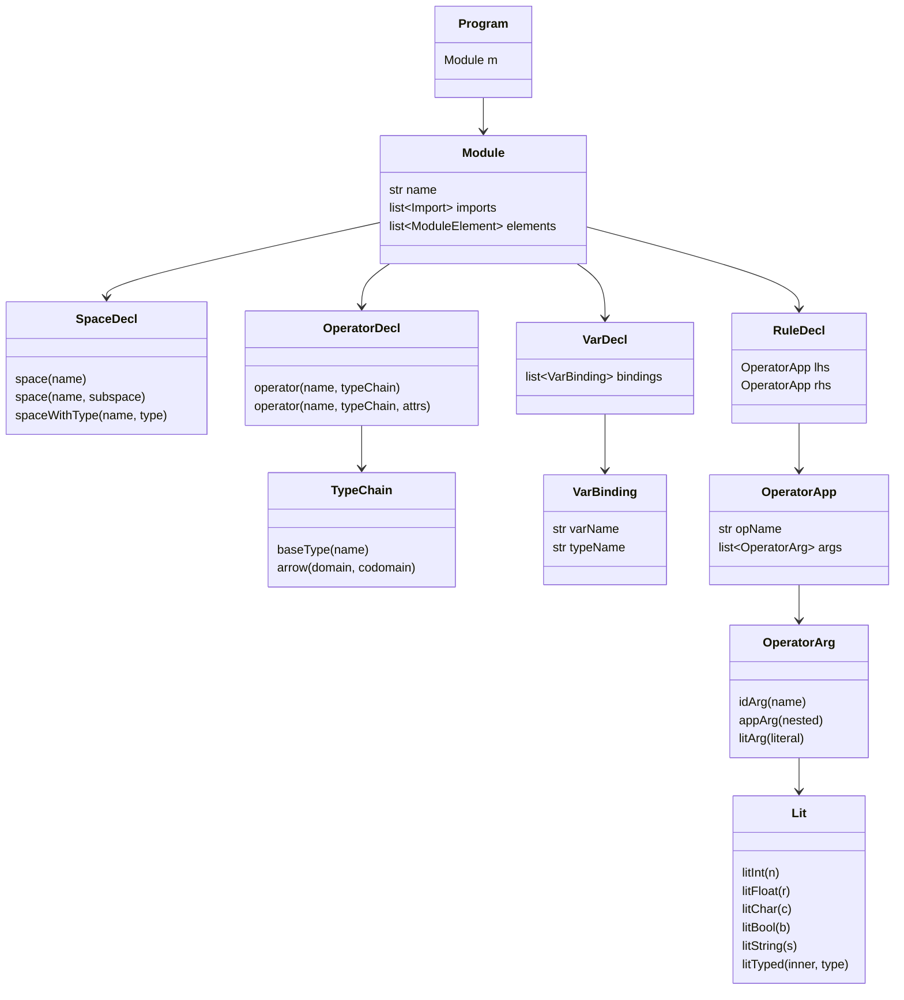
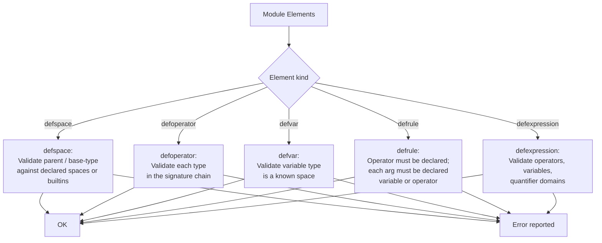

# VeriLang

**Authors:** Felipe Mesa, Diego Rodriguez

---

## Overview

VeriLang is a formal specification language implemented in Rascal. It allows users to define algebraic structures composed of spaces (sorts), operators, variables, rewrite rules, and logical expressions. Programs are written in plain text files with the `.vl` extension and processed by the VeriLang toolchain, which parses, type-checks, and validates them.

---

## Authors

| Name             | Code        |
|------------------|-------------|
| Felipe Mesa      | 202123007  |
| Diego Rodriguez  | 202225217   |

---

## Project Structure

```
project2/
  META-INF/
    RASCAL.MF              Rascal project manifest
  src/verilang/
    Syntax.rsc             Grammar (lexical + context-free rules)
    AST.rsc                Abstract syntax tree data types
    Implode.rsc            Parse tree to AST conversion
    Parser.rsc             Entry points for parsing .vl files
    Evaluator.rsc          Main runner: parse, type-check, report
    TypeChecker.rsc        Custom type checker (no external deps)
    Typecheck.rsc          TypePal-based type checker (requires TypePal)
    SemanticRules.rsc      Existence and semantic validation rules
  examples/
    valid/                 Programs that parse and check correctly
    invalid/               Programs with intentional errors
  pom.xml                  Maven build file (includes TypePal dependency)
```

---

## Module Architecture



---

## Processing Pipeline



---

## Grammar Overview



---

## AST Data Types



---

## Type Checking Flow



---

## Language Reference

### Module

```
defmodule Name
  using OtherModule
  ... declarations ...
end
```

### Space declaration

```
defspace Name end
defspace Name < ParentSpace end
defspace Name : BaseType end
```

The third form (new in this version) annotates the space with a base primitive type
(`Int`, `Bool`, `Char`, `String`, `Float`).

### Operator declaration

```
defoperator name : TypeA -> TypeB -> ReturnType end
defoperator name : TypeA -> ReturnType [ attribute ] end
```

### Variable declaration

```
defvar x : SpaceName , y : SpaceName end
```

### Rewrite rule

```
defrule (lhsOp arg1 arg2) -> (rhsOp arg1) end
```

### Expression

```
defexpression forall x in Space . (op x) end
defexpression exists x in Space . (op x) => (id x) end
```

### Literals and type annotations

| Kind   | Example          | With annotation     |
|--------|------------------|---------------------|
| Int    | `42`             | `42:Int`            |
| Float  | `3.14`           | `3.14:Float`        |
| Char   | `'a'`            | `'a':Char`          |
| Bool   | `true`, `false`  | `true:Bool`         |
| String | `"hello"`        | `"hello":String`    |

### Logical operators (precedence low to high)

```
forall x in S . Expr
exists x in S . Expr
Expr equiv Expr
Expr => Expr
Expr and Expr
Expr or Expr
neg Expr
( Expr )
```

---

## Built-in Primitive Types

The following type names are always valid without a `defspace` declaration:

- `Int`
- `Bool`
- `Char`
- `String`
- `Float`

---

## Semantic Rules (Task 6)

The `SemanticRules` module enforces that every name used inside a construct is declared:

1. **Operator applications** - the operator and every identifier argument must be declared.
2. **Type chains** - every space name in an operator signature must be known.
3. **Variable bindings** - the declared type must be a known space.
4. **Subspace relations** - the parent space must be declared or built-in.
5. **Typed space declarations** - the base-type annotation must be a known type.
6. **Quantifiers** - the domain must be a declared space or built-in.
7. **Member-of expressions** - both the element and the collection must be declared.
8. **Typed literals** - the annotation type must be a known space or built-in.

---

## Example Programs

### Valid: Bool module (`examples/valid/02-bool.vl`)

```
defmodule Bool
defspace Bool end
defoperator not : Bool -> Bool end
defoperator and : Bool -> Bool -> Bool [ associative commutative ] end
defoperator or  : Bool -> Bool -> Bool [ associative commutative ] end
defvar p : Bool , q : Bool end
defrule (not (not p)) -> (id p) end
defexpression forall p in Bool . (not p) end
end
```

### Valid: Nat module with typed spaces (`examples/valid/04-typed.vl`)

```
defmodule TypedExample
defspace IntSpace : Int end
defspace BoolSpace : Bool end
defspace Nat < IntSpace end
defoperator zero  : IntSpace end
defoperator succ  : IntSpace -> IntSpace end
defoperator add   : IntSpace -> IntSpace -> IntSpace [ associative id : zero ] end
defvar n : IntSpace , m : IntSpace end
defrule (add (succ n) m) -> (succ (add n m)) end
defexpression forall n in IntSpace . (add zero n) => (id n) end
end
```

### Invalid: undeclared operator (`examples/invalid/05-bad-element.vl`)

```
defmodule BadElement
defspace Nat end
defoperator succ : Nat -> Nat end
defvar n : Nat end
defrule (ghost n) -> (succ n) end   // "ghost" is not declared
end
```

---

## How to Run

### 1. Open the Rascal terminal in VS Code

Open the Command Palette (`Ctrl+Shift+P`) and run **Rascal: Start Terminal**.

### 2. Run a .vl program

```rascal
import verilang::Evaluator;
run(|file:///C:/path/to/file.vl|);
```

### 3. Run only the parser

```rascal
import verilang::Parser;
parseFile(|file:///C:/path/to/file.vl|);
```

### 4. Run only the type checker

```rascal
import verilang::TypeChecker;
checkAndReport(|file:///C:/path/to/file.vl|);
```

### 5. Run the TypePal-based checker (requires TypePal installed via Maven)

```rascal
import verilang::Typecheck;
checkAndReport(|file:///C:/path/to/file.vl|);
```

### 6. Run on the provided examples

```rascal
import verilang::Evaluator;
run(|file:///C:/Users/PATECNOLOGICOS/OneDrive/Escritorio/Universidad/Octavo%20Semestre/lym/project2/examples/valid/02-bool.vl|);
run(|file:///C:/Users/PATECNOLOGICOS/OneDrive/Escritorio/Universidad/Octavo%20Semestre/lym/project2/examples/valid/03-nat.vl|);
run(|file:///C:/Users/PATECNOLOGICOS/OneDrive/Escritorio/Universidad/Octavo%20Semestre/lym/project2/examples/valid/04-typed.vl|);
run(|file:///C:/Users/PATECNOLOGICOS/OneDrive/Escritorio/Universidad/Octavo%20Semestre/lym/project2/examples/invalid/04-bad-type.vl|);
run(|file:///C:/Users/PATECNOLOGICOS/OneDrive/Escritorio/Universidad/Octavo%20Semestre/lym/project2/examples/invalid/05-bad-element.vl|);
```

---

## Installing TypePal

TypePal is declared in `pom.xml` as a Maven dependency. To download and activate it:

1. In VS Code, open the Command Palette and run **Java: Reload Projects** (or right-click `pom.xml` and select **Reload project**).
2. Restart the Rascal terminal.
3. Import `verilang::Typecheck` to use the TypePal-based type checker.

---

## Requirements

- Visual Studio Code with the Rascal extension
- Java 11 or newer
- Maven (for TypePal dependency resolution)
